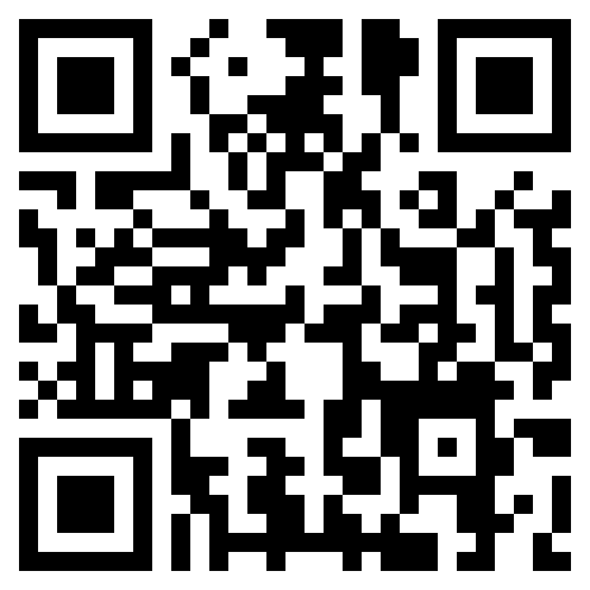
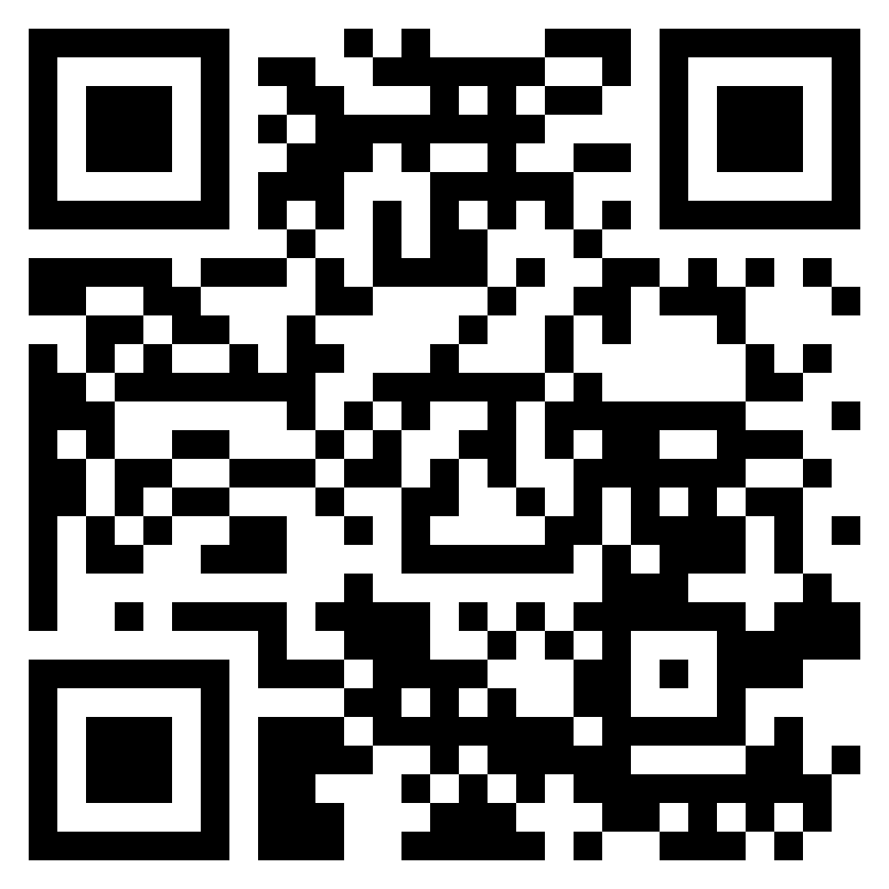
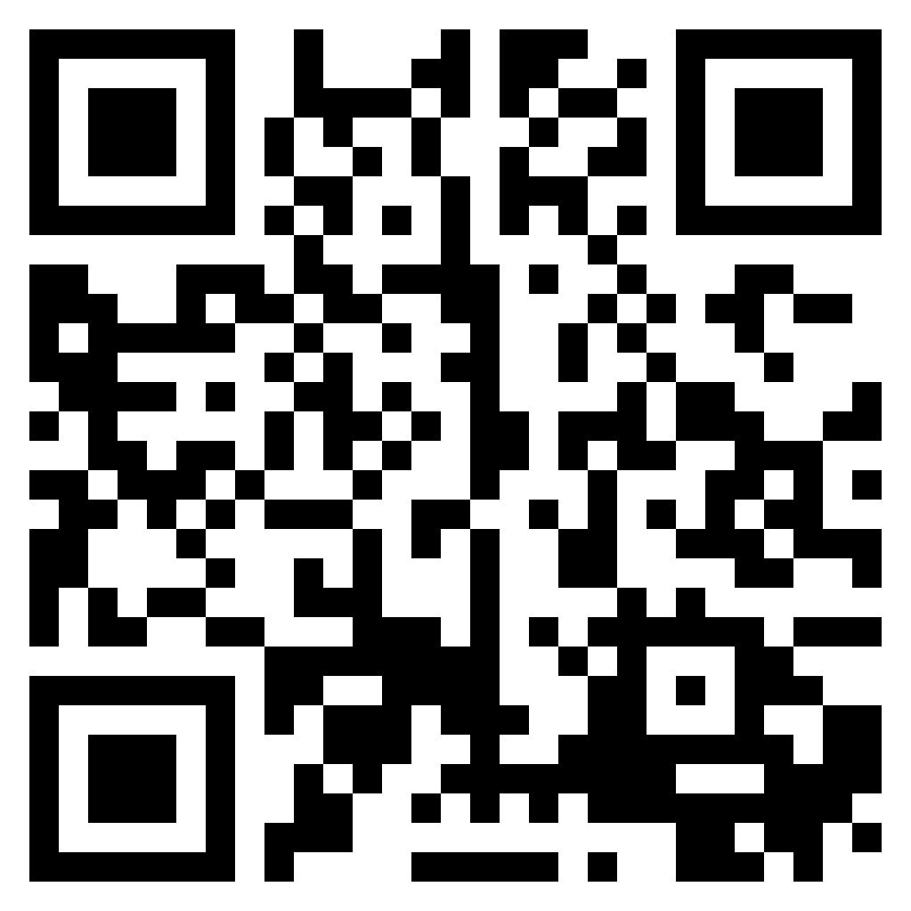
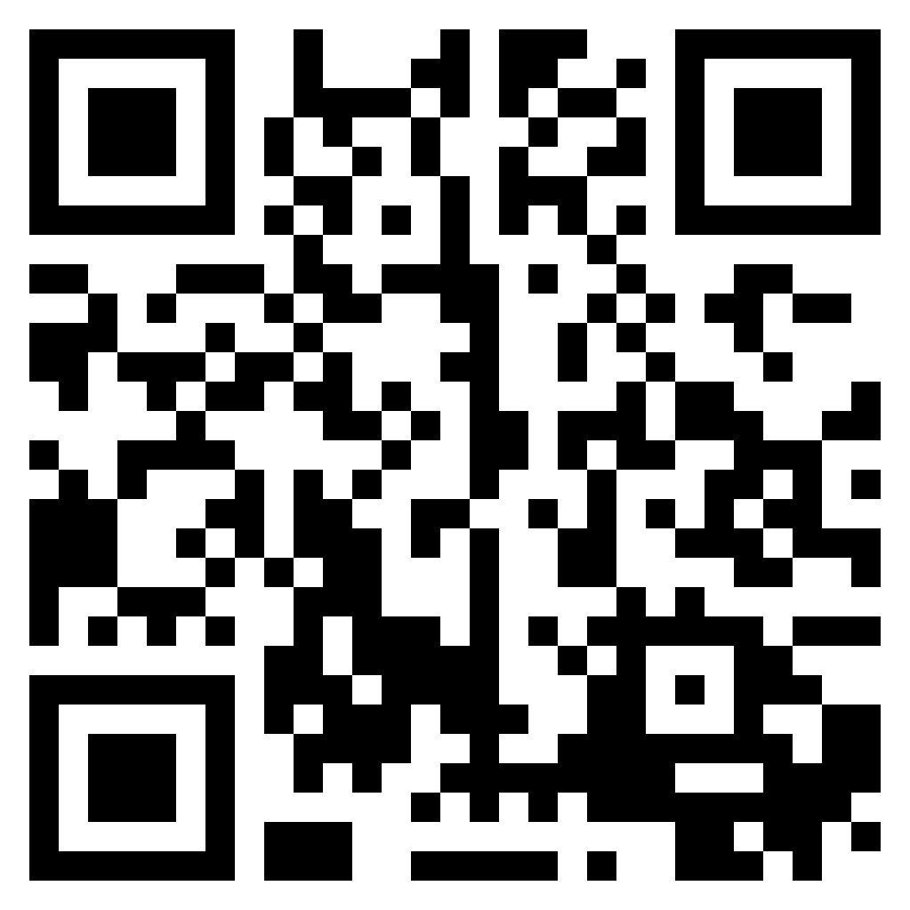
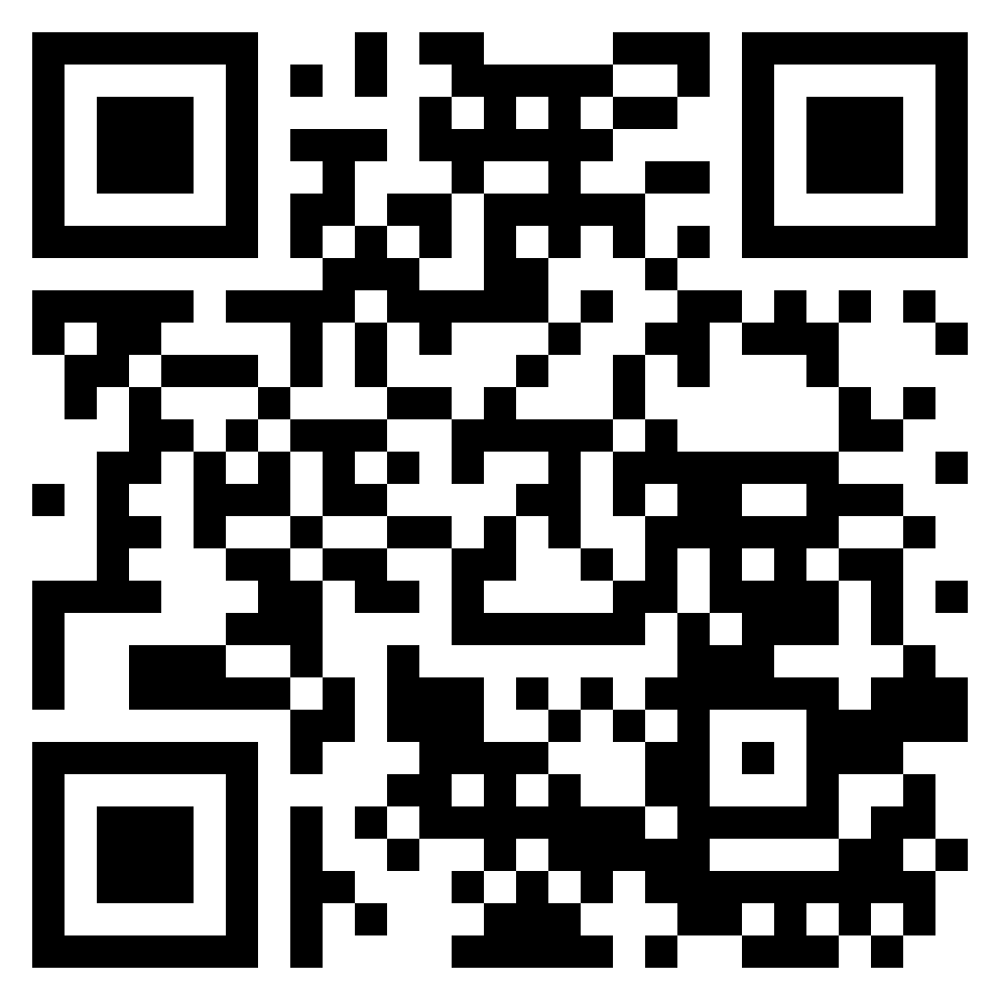
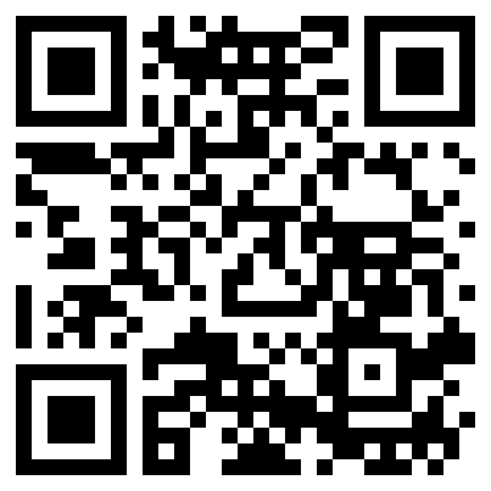
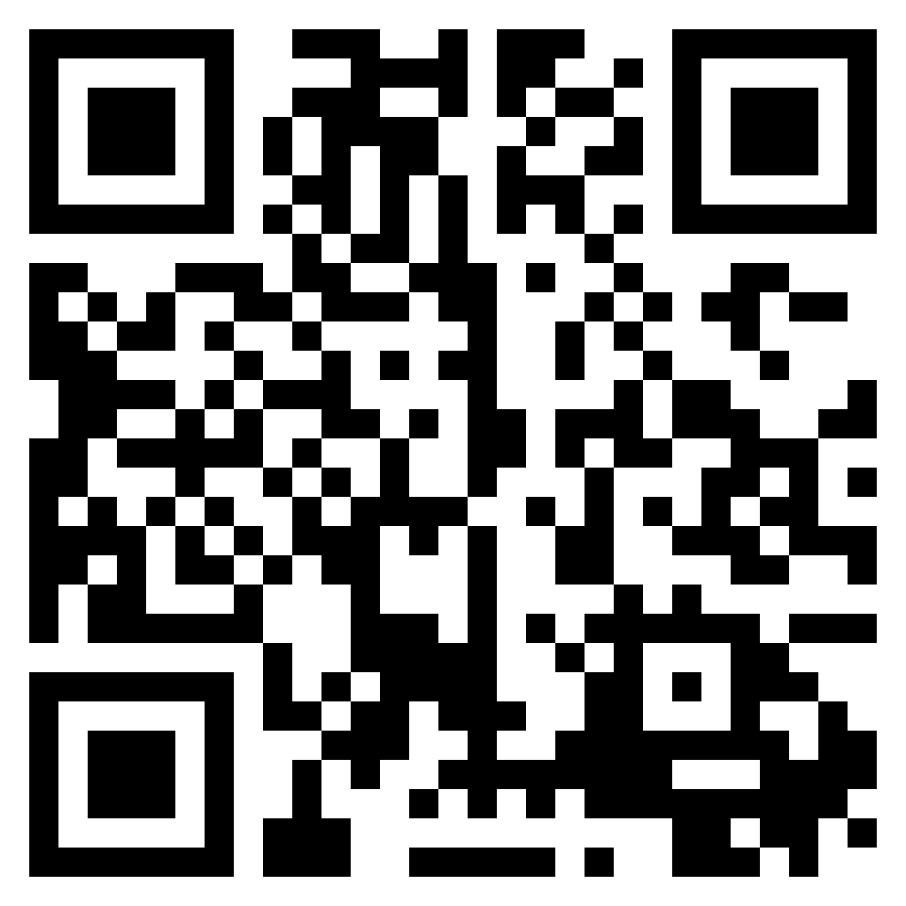
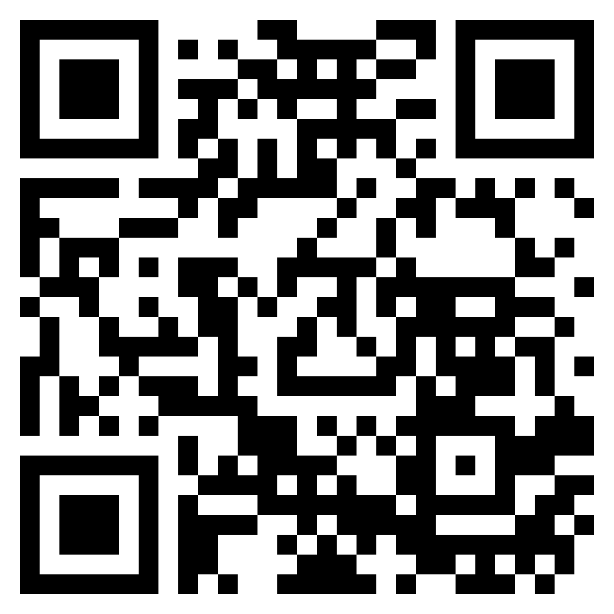
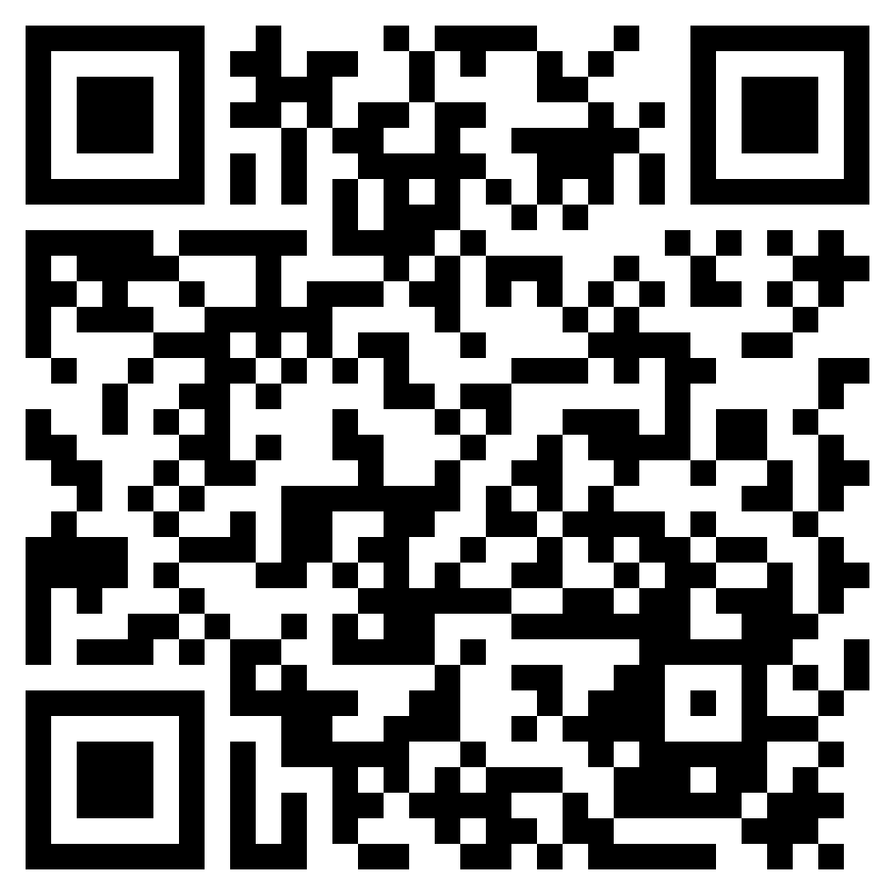

# V2ray Collector

To use this project, simply import the subscription links into your preferred client. Ensure that your client supports at least SHADOWSOCKS, VLESS, VMESS, TROJAN, TUIC and HYSTERIA2.
 
 
<em>
Powered by @Yebekhe (<a href="https://github.com/yebekhe/TVC" target="_blank">TVC</a>)
</em>

| SUB         | URL                                                                                    | QRCODE                                                                         |
|-------------|----------------------------------------------------------------------------------------|--------------------------------------------------------------------------------| 
| MIX         | [LINK](https://github.com/Amirinventor2010/TVC-Amirinventor/raw/main/sub/mix)                              |  |
| REALITY     | [LINK](https://github.com/Amirinventor2010/TVC-Amirinventor/raw/main/sub/reality)                          |  |
| VLESS       | [LINK](https://github.com/Amirinventor2010/TVC-Amirinventor/raw/main/sub/vless)                            |  |
| VMESS       | [LINK](https://github.com/Amirinventor2010/TVC-Amirinventor/raw/main/sub/vmess)                            |  |
| SHADOWSOCKS | [LINK](https://github.com/Amirinventor2010/TVC-Amirinventor/raw/main/sub/ss)                               |  |
| TROJAN      | [LINK](https://github.com/Amirinventor2010/TVC-Amirinventor/raw/main/sub/trojan)                           |  |
| HYSTERIA2   | [LINK](https://github.com/Amirinventor2010/TVC-Amirinventor/raw/main/sub/hy2)                              |  |
| TUIC        | [LINK](https://github.com/Amirinventor2010/TVC-Amirinventor/raw/main/sub/tuic)                             |  |
| WARP        | [LINK](https://raw.githubusercontent.com/ircfspace/warpsub/main/export/warp) |  |
